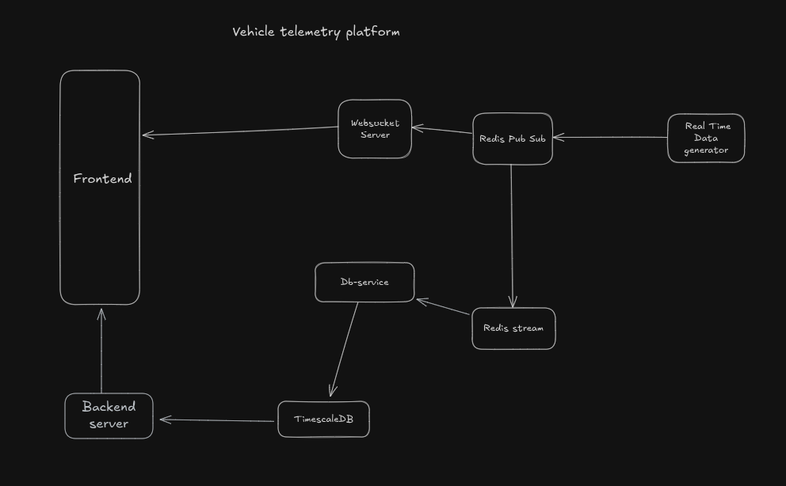

## System Design

### Architecture Overview
This vehicle telematics system is designed to handle real-time vehicle data ingestion, processing, and client updates with a scalable and efficient stack:

- **Data Producer (Vehicles):**
  - Send telemetry events continuously.
  - Built with **go** to send synthetic realtime data using a json file initially to the message broker.
- **Backend API:**  
  - Built with **Node.js** to query car historic data from timescaledb.  
- **WebSocket Server:**  
  - Built with **Node.js** to handle real-time communication with clients.  
  - Subscribes to Redis streams to broadcast updates to connected Next.js clients.
- **Frontend:**  
  - **React.js** React-based UI providing dashboards and real-time vehicle status visualization.
- **Database:**  
  - Time-series TimescaleDB to store historical vehicle data for analytics and reports.
- **Message Broker:**  
  - Redis Streams to buffer and process high-throughput telemetry events reliably.

### Data Flow
1. Vehicles send real-time telemetry events to the Go backend API.
2. The Go backend validates events and pushes them to Redis Streams.
3. Node.js WebSocket server listens to Redis Streams and broadcasts updates to Next.js clients.
4. React.js frontend receives live updates and displays vehicle statuses and analytics.
5. Historical data is saved to the database for long-term storage and offline analysis.

### Key Design Decisions
- **Go backend** chosen for low-latency, high-throughput data processing.
- **Redis Streams** used over Pub/Sub for durability and message persistence.
- **Node.js WebSocket server** to efficiently manage client connections and real-time data push.
- **React.js frontend** easy to build responsive UI.
- Database choice (PostgreSQL/TimescaleDB) supports complex queries and time-series an

### Diagram

